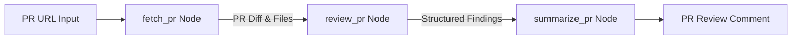

# 🤖 PR Reviewer Agent Crew

An autonomous multi-agent Pull Request (PR) code review tool built with **LangGraph**, **GitHub REST API / MCP**, and **Gemini / LLMs**.

---

## 🏗️ Architecture Overview



The pipeline uses **LangGraph** to coordinate a 3-node stateful workflow:

1. **`fetch_pr` Node**:
   - Parses GitHub PR URL.
   - Retrieves PR metadata, raw git diff (`application/vnd.github.v3.diff`), and changed file list via GitHub API / MCP.
2. **`review_pr` Node**:
   - Analyzes git diff against security & quality standards using LLM (Gemini).
   - Scans specifically for:
     - 🔐 **Hardcoded Secrets**: Plaintext API keys, credentials, bearer tokens.
     - 🛡️ **Missing Input Validation**: Unsanitized parameters, path traversal, untrusted inputs.
     - 💉 **SQL Injection**: Unsafe string formatting / concatenation in queries.
     - ⚠️ **Missing Error Handling**: Swallowed exceptions (`except: pass`), unchecked IO/network operations.
   - Includes heuristic fallback parser if LLM keys are absent.
3. **`summarize_pr` Node**:
   - Compiles findings into a GitHub PR-comment style Markdown summary complete with severity badges, category audit checklists, and line-by-line remediation tips.

---

## 🚀 Quickstart Guide

### 1. Installation

Clone the repository and install Python dependencies:

```bash
git clone https://github.com/your-username/pr-reviewer-crew.git
cd pr-reviewer-crew
pip install -r requirements.txt
```

### 2. Environment Configuration

Create a `.env` file based on `.env.example`:

```bash
cp .env.example .env
```

Set your API keys:

```env
GITHUB_TOKEN=your_github_personal_access_token
GEMINI_API_KEY=your_gemini_api_key
```

---

## 💻 Usage Options

### CLI Entry Point

Run full pipeline against any public GitHub PR:

```bash
python main.py https://github.com/psf/requests/pull/6700
```

### Streamlit Web Interface

Launch interactive Web UI:

```bash
streamlit run app.py
```

Open browser at `http://localhost:8501`.

---

## 🧪 Testing

Test pipeline against sample open-source pull requests:
- `https://github.com/psf/requests/pull/6700`
- `https://github.com/pallets/flask/pull/5000`

---

## 🛠️ Project Structure

```
├── graph.py            # LangGraph workflow compilation
├── main.py             # CLI entry point
├── app.py              # Streamlit Web UI
├── state.py            # LangGraph state schema (PRReviewState, Finding)
├── github_utils.py     # GitHub REST/MCP diff fetcher
├── nodes/
│   ├── __init__.py     # Node exports
│   ├── fetch_node.py   # Node 1: PR data retriever
│   ├── review_node.py  # Node 2: LLM vulnerability reviewer
│   └── summarize_node.py # Node 3: Markdown report generator
├── requirements.txt    # Dependencies
├── README.md           # Documentation
└── .env.example        # Environment template
```
